# 🎓 MathEducatorz - Enterprise Educational Management System

<p align="center">


</p>

---

# 📖 Project Overview

**MathEducatorz** is a complete **Enterprise-Level Educational Management System (EMS)** developed for online educational institutes that operate across multiple countries. The platform centralizes student admissions, trainer management, subject organization, fee collection, lecture scheduling, assignment handling, and academic operations into a single, role-based web application.

Unlike a traditional Learning Management System (LMS), this project combines the functionality of an **Educational ERP**, **Student Information System (SIS)**, and **Learning Management System (LMS)**.

The system also includes a fully dynamic public website connected directly with the administration panel, allowing educational institutes to manage countries, subjects, pricing plans, admissions, and trial class requests without modifying any source code.

The platform has been designed with scalability, maintainability, and modular architecture in mind, making it suitable for small academies as well as large international educational organizations.

---

# 🚀 Key Highlights

- 🌍 Multi-Country Educational Platform
- 👨‍🎓 Complete Student Information System
- 👨‍🏫 Teacher Management Portal
- 👨‍💼 Enterprise Admin Dashboard
- 📚 Dynamic Subject Management
- 🎥 Live Class Scheduling
- 🎬 Recorded Lecture Management
- 📝 Assignment Management
- 💳 Fee & Invoice Management
- 📦 Country-wise Pricing Packages
- 🌐 Dynamic Website Integration
- 🔐 Role Based Authentication
- 📊 Dashboard Analytics
- 📱 Fully Responsive Interface
- ⚡ Built with Laravel Livewire

---

# 🎯 Problem Statement

Educational institutes often use multiple disconnected systems to manage admissions, teachers, fee collection, schedules, online classes, and student records.

Managing all these operations manually creates:

- Data duplication
- Time-consuming administrative work
- Poor communication
- Scheduling conflicts
- Inefficient fee tracking
- Difficult student management

MathEducatorz solves these problems by providing a centralized educational management platform where administrators, teachers, and students work together through separate role-based dashboards.

---

# 💡 Solution

The system digitizes the complete educational workflow by providing:

- Centralized Student Management
- Digital Admissions
- Teacher Management
- Academic Scheduling
- Subject & Lesson Management
- Online Learning Support
- Assignment Tracking
- Fee Collection
- Invoice Generation
- Student Enrollment
- Website Integration

Everything is managed through one centralized Laravel application.

---

# 🏗️ System Architecture

```
                      Public Website
                             │
                             │
                  Trial Class Registration
                             │
                             ▼
                    Admission Management
                             │
                             ▼
                    Admin Dashboard
                             │
        ┌──────────────┬──────────────┬─────────────┐
        │              │              │             │
        ▼              ▼              ▼             ▼
    Teachers       Students      Subjects      Accounts
        │              │              │             │
        └──────────────┴──────────────┴─────────────┘
                             │
                             ▼
                  Assignments & Lectures
```

---

# 🌐 User Roles

The platform provides dedicated dashboards for multiple user roles.

## 👨‍💼 Administrator

The administrator controls the complete educational platform.

Responsibilities include:

- Website Management
- Trial Requests
- Countries
- Subjects
- Trainers
- Student Admissions
- Packages
- Fee Management
- Timetable
- User Management
- Reports
- Settings

---

## 👨‍🏫 Teacher

Teachers receive their own dashboard where they can:

- View Assigned Students
- Manage Assignments
- Check Schedule
- Access Subjects
- Monitor Student Progress

---

## 👨‍🎓 Student

Students can:

- View Dashboard
- Access Subjects
- Watch Lecture Recordings
- Submit Assignments
- View Payment Information
- Manage Profile Settings

---

# 🛠 Technology Stack

## Backend

- Laravel
- Livewire
- PHP

## Frontend

- Bootstrap 5
- JavaScript
- HTML5
- CSS3

## Database

- MySQL

## Authentication

- Laravel Authentication
- Role Based Middleware

## Development Tools

- Composer
- NPM
- Git
- GitHub

---

# ✨ Core Features

## 🌍 Multi Country Management

The platform allows educational institutes to operate in multiple countries while maintaining separate pricing, packages, and educational content.

---

## 🎓 Student Admission System

A complete admission workflow including:

- New Admission
- Re-Admission
- Enrollment
- Student Profile
- Trainer Assignment

---

## 👨‍🏫 Trainer Management

Complete trainer management including:

- Trainer Profiles
- Assigned Subjects
- Timetable
- Categories

---

## 📚 Subject Management

Subjects are organized in a structured hierarchy.

```
Country

    ↓

Subject

    ↓

Grade / Year

    ↓

Lessons

    ↓

Lecture Recordings
```

---

## 💰 Financial Management

The accounting module supports:

- Fee Collection
- Monthly Receivables
- Student Payments
- Invoice Management
- Receipt Generation

---

## 📝 Assignment Management

Teachers can create assignments while students can submit solutions directly through their dashboards.

---

## 🎥 Lecture Management

Supports:

- Live Classes
- Class Scheduling
- Recorded Lectures
- Pending Recordings

---

## 🌐 Website Integration

The public website is directly connected with the Admin Panel.

Administrators can manage:

- Countries
- Subjects
- Packages
- Pricing
- Trial Requests

without editing any code.

---

# 🔐 Authentication & Security

The project implements secure role-based authentication.

Supported Roles:

- Administrator
- Teacher
- Student

Each role has:

- Dedicated Dashboard
- Separate Routes
- Separate Middleware
- Access Control
- Permission-Based Navigation

---

# 📂 Project Structure

```
app/
bootstrap/
config/
database/
public/
resources/
routes/
storage/

Admin Panel
Teacher Portal
Student Portal
Public Website
```

---

# 📸 Project Preview

## 🏠 Admin Dashboard

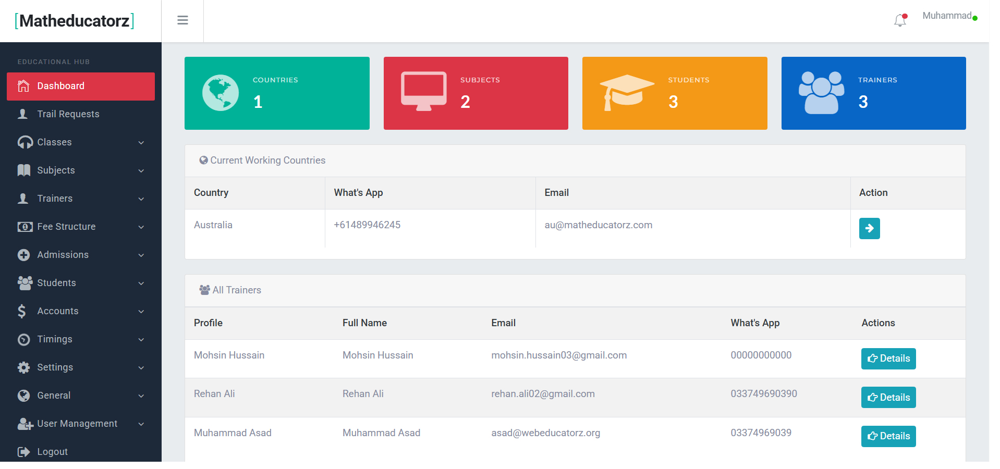

The dashboard provides administrators with a complete overview of countries, subjects, students, trainers, trial requests, and system activities.

---

# 🚀 Upcoming Sections

The next part of this documentation covers:

- Complete Admin Panel
- Trial Request Module
- Class Scheduling
- Subject Management
- Trainer Management
- Fee Structure
- Student Management
- Accounts Module
- Timetable
- General Settings
- User Management
- Detailed Screenshots
# 🛡️ Admin Panel

The **Administrator Dashboard** is the central control hub of the entire educational platform. It provides complete control over website content, students, trainers, classes, admissions, financial operations, user management, and academic resources.

The system follows a modular architecture where each module is responsible for managing a specific business process.

---

# 📊 Dashboard

The dashboard provides administrators with a quick overview of the entire platform.

### Features

- Total Working Countries
- Total Subjects
- Total Students
- Total Trainers
- Current Active Countries
- Trainer Summary
- Quick Navigation
- System Statistics

### Dashboard Overview


---

# 🌐 Trial Class Requests

The public website includes a **Book Trial Class** form where interested students can submit their details.

Every request is stored inside the admin panel for follow-up.

### Features

- View Trial Requests
- Student Contact Details
- Country Information
- Convert Trial into Admission
- Track Interested Students

### Screenshot


---

# 📅 Classes Management

The Classes module allows administrators to organize and manage online educational sessions.

It ensures proper scheduling and management of live classes while keeping lecture recordings organized.

---

## Today's Classes Schedule

Administrators can view all classes scheduled for the current day.

### Features

- Today's Classes
- Assigned Teacher
- Time Slot
- Subject
- Student Group

### Screenshot

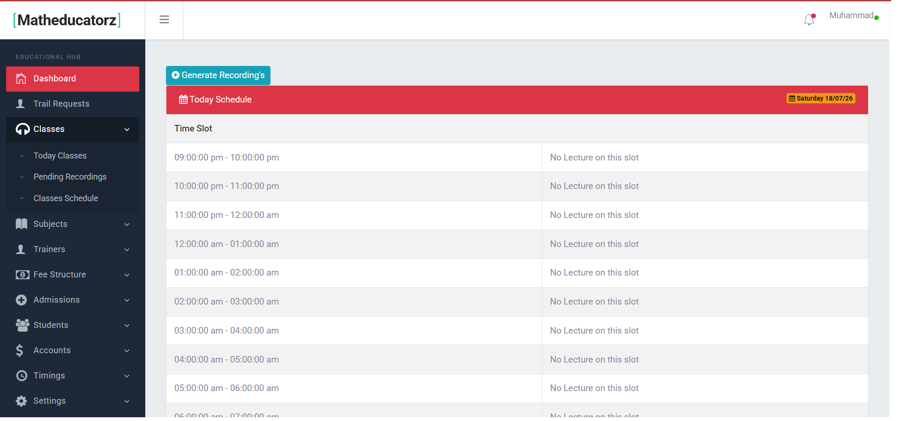

---

## Complete Class Schedule

The complete timetable of all classes can be managed from one place.

### Features

- Weekly Schedule
- Teacher Timetable
- Subject Allocation
- Time Slot Management
- Class Availability

### Screenshot

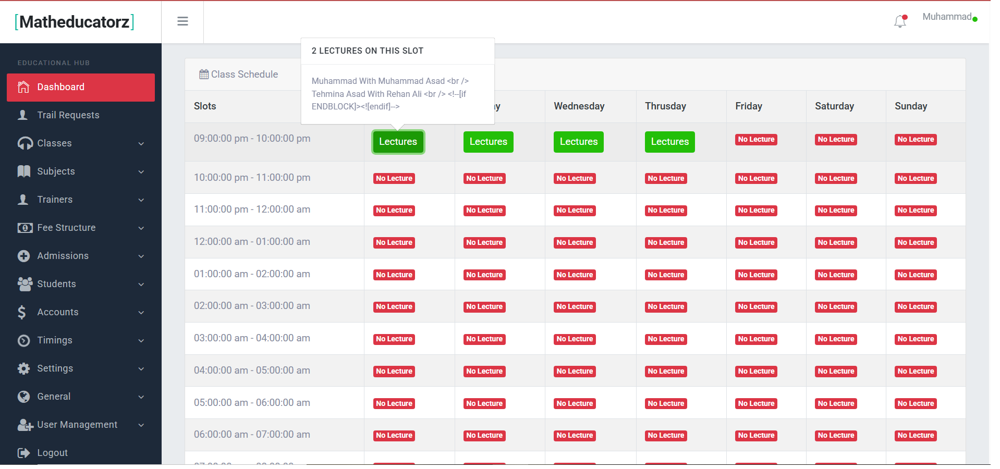

---

## Pending Lecture Recordings

After every live session, recordings can be managed from this section.

### Features

- Pending Recordings
- Upload Lecture Videos
- Manage Recorded Classes
- Recording Status

### Screenshot

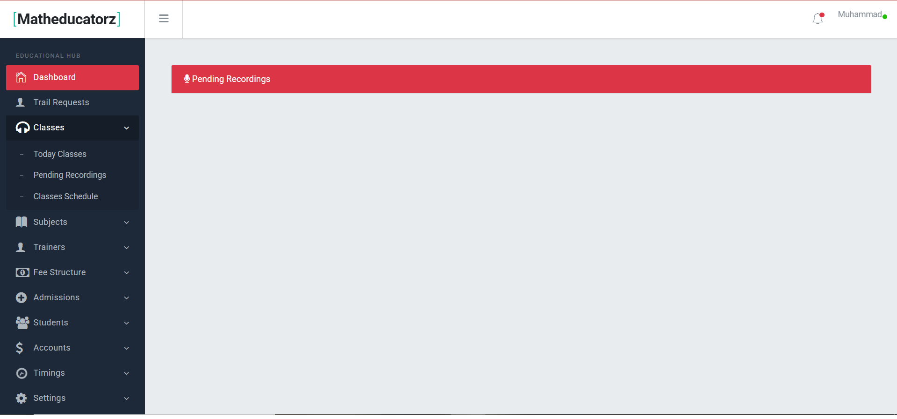

---

# 📚 Subject Management

The Subject Management module organizes educational content in a structured hierarchy.

```
Country
      │
      ▼
Subject
      │
      ▼
Grade / Year
      │
      ▼
Lessons
      │
      ▼
Lecture Recordings
```

This architecture allows institutes to manage different educational programs for multiple countries.

---

## Create New Subject

Administrators can create unlimited subjects.

### Features

- Subject Name
- Country Assignment
- Subject Description
- Status Management

### Screenshot

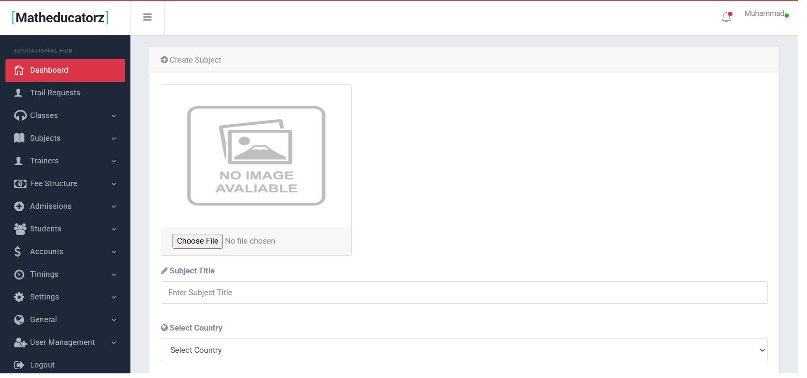

---

## Subject List

Displays all created subjects.

### Features

- Search Subjects
- Edit Subject
- Delete Subject
- Status Control

### Screenshot

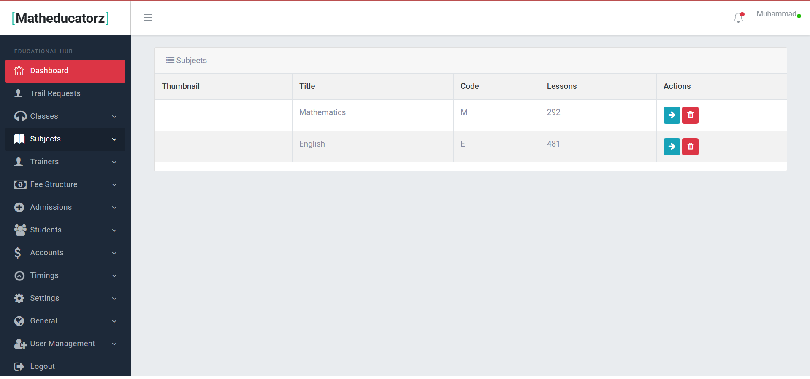

---

## Country Wise Subject Management

Different countries can have different educational structures.

### Features

- Country Selection
- Subject Allocation
- Dynamic Website Integration

### Screenshot

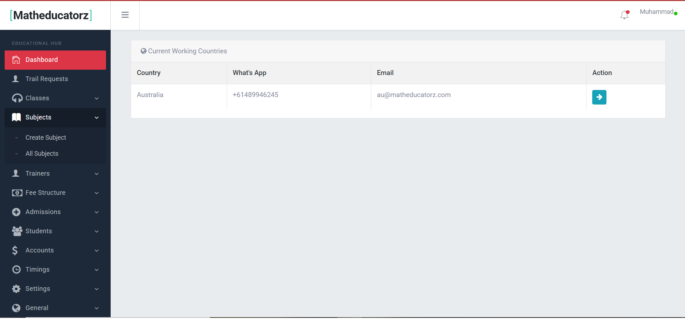

---

## Grade / Year Management

Every subject can contain multiple grades or academic years.

### Features

- Grade Creation
- Year Management
- Curriculum Organization

### Screenshot

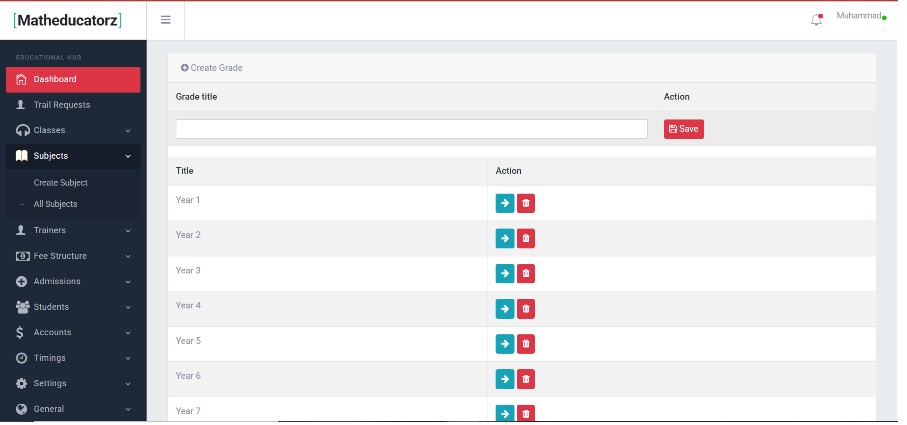

---

## Lesson Management

Lessons are created under every grade.

### Features

- Lesson Title
- Description
- Recorded Lecture
- Learning Material

### Screenshot

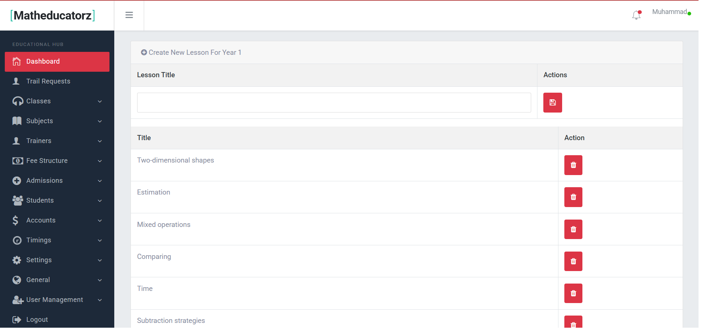

---

# 👨‍🏫 Trainer Management

The Trainer Management module helps administrators manage teaching staff efficiently.

---

## Create Trainer

Create teacher accounts with complete profile information.

### Features

- Personal Details
- Contact Information
- Profile Image
- Login Credentials

### Screenshot


---

## Trainers List

Displays all trainers in one place.

### Features

- Search Trainers
- Edit Trainer
- Delete Trainer
- Status Management

### Screenshot

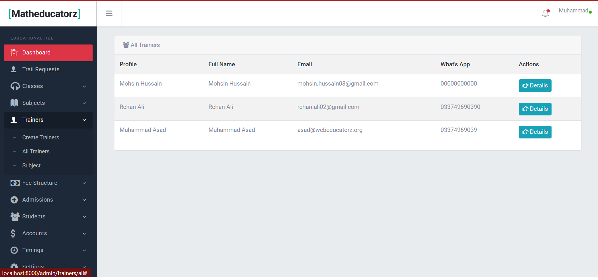

---

## Subject Assignment

Subjects can be assigned to trainers according to their expertise.

### Features

- Subject Allocation
- Multiple Subjects
- Country Based Assignment

### Screenshot

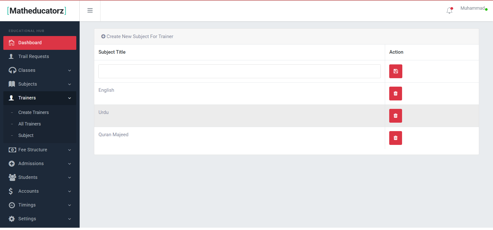

---

## Trainer Profile

Each trainer has a detailed profile.

### Features

- Assigned Subjects
- Timetable
- Contact Details
- Academic Information

### Screenshot

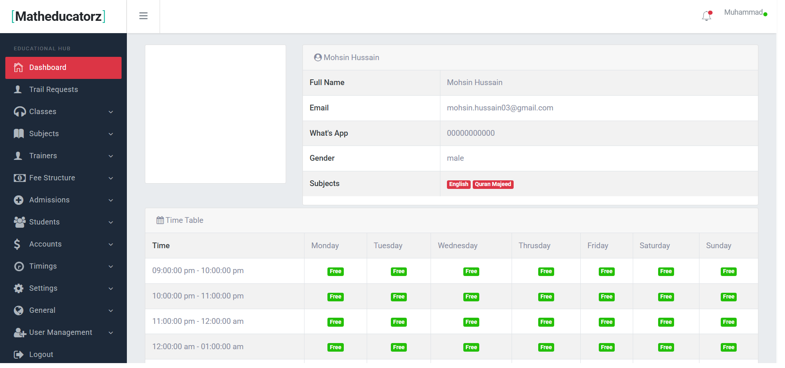

---

# 💳 Fee Structure Management

The Fee Structure module allows institutes to manage pricing for different countries.

---

## Create New Package

Create educational packages.

### Features

- Package Name
- Price
- Duration
- Description

### Screenshot


---

## Country Wise Packages

Different countries can have independent pricing.

### Features

- Country Selection
- Currency Support
- Country Pricing

### Screenshot


---

## Package Facilities

Each package may include different facilities.

Examples

- Live Classes
- Recorded Lectures
- Certificates
- Notes
- WhatsApp Support

### Screenshot


---

## Package Categories

Organize educational plans into categories.

Examples

- Beginner
- Intermediate
- Advanced
- Premium

### Screenshot


---

## All Packages

Displays every available educational package.

### Features

- Search
- Edit
- Delete
- Status Control

### Screenshot


---

# 🎯 What's Covered in Part 2

✔ Dashboard

✔ Trial Requests

✔ Classes Management

✔ Subject Management

✔ Trainer Management

✔ Fee Structure

---

➡️ **Part 3** will cover:

- Student Admissions
- Student Management
- Accounts Module
- Timetable
- General Settings
- User Management
- Teacher Portal
- Student Portal
- Complete Screenshots & Feature Documentation
# 👨‍🎓 Student Admission Management

The Admission Management module handles the complete student enrollment process from registration to subject allocation and fee collection.

The system simplifies admissions by integrating country-wise packages, trainer assignment, enrollment management, invoicing, and payment tracking into a single workflow.

---

## Admission Workflow

```text
Website Trial Request
        │
        ▼
Student Admission
        │
        ▼
Package Selection
        │
        ▼
Invoice Generation
        │
        ▼
Fee Payment
        │
        ▼
Student Enrollment
        │
        ▼
Trainer Assignment
        │
        ▼
Class Allocation
```

---

## New Admission

Administrators can register new students using country-specific educational packages.

### Features

- Student Registration
- Country Selection
- Package Selection
- Trainer Assignment
- Subject Enrollment
- Invoice Generation
- Fee Collection
- Receipt Printing

### Screenshot


---

# 👨‍🎓 Student Management

The Student Management module stores complete academic information for every enrolled student.

Administrators can easily monitor progress, assigned teachers, enrolled subjects, fee status, and profile information.

---

## Student List

### Features

- Search Students
- Active Students
- Edit Student
- Delete Student
- View Details
- Enrollment Status

### Screenshot

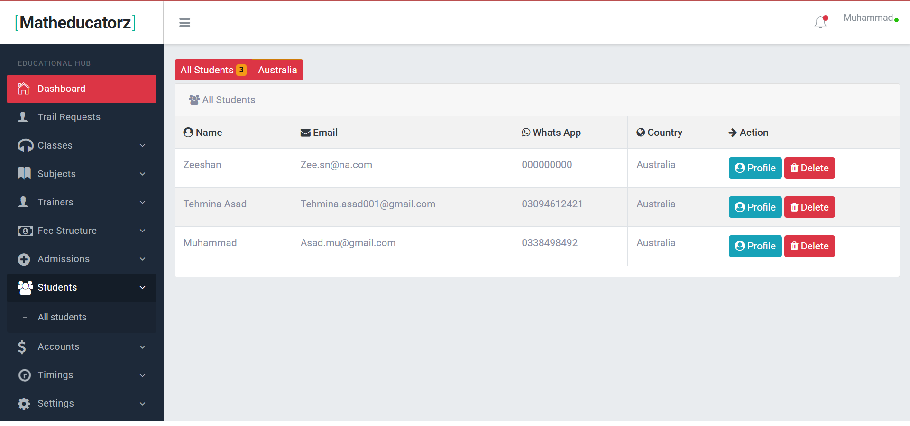

---

## Student Profile

Every student has a detailed profile containing complete academic and financial information.

### Features

- Personal Information
- Contact Information
- Assigned Trainer
- Enrolled Subjects
- Payment History
- Attendance Information
- Academic Progress

### Screenshot

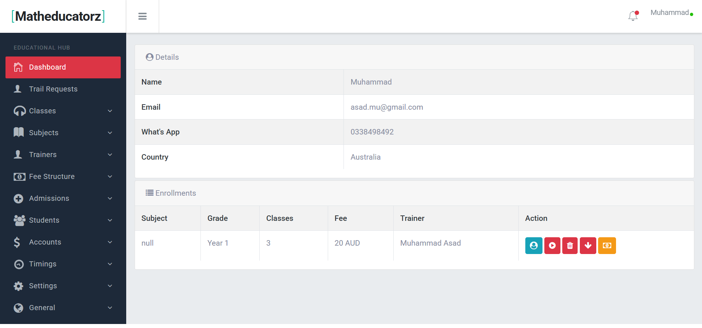

---

# 💰 Accounts & Financial Management

The Accounts module enables administrators to manage educational finances efficiently.

The system tracks student payments, outstanding balances, monthly income, invoices, and payment history.

---

## Fee Management

Country-wise fee management ensures different pricing models for different regions.

### Features

- Student Fee Collection
- Country Wise Pricing
- Package Fee Tracking
- Pending Payments
- Paid Amount
- Remaining Balance

### Screenshot

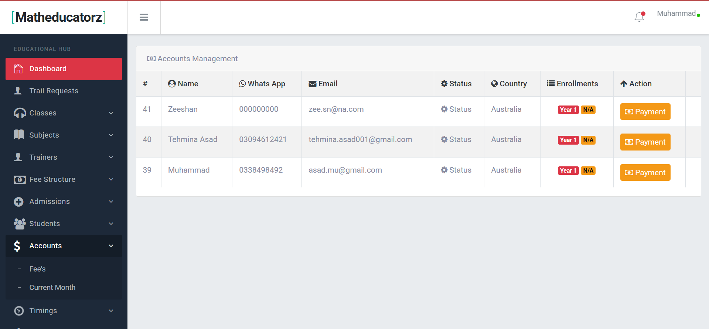

---

## Current Month Upcoming Receivings

The system automatically displays upcoming fee collections for the current month.

### Features

- Upcoming Payments
- Monthly Receivables
- Student Due List
- Expected Revenue

### Screenshot


---

# 🕒 Timetable Management

The timetable module is responsible for managing available teaching slots and weekly schedules.

This module prevents scheduling conflicts while improving teacher availability management.

---

## Time Slots

### Features

- Create Time Slots
- Edit Slots
- Delete Slots
- Weekly Scheduling
- Teacher Availability

### Screenshot

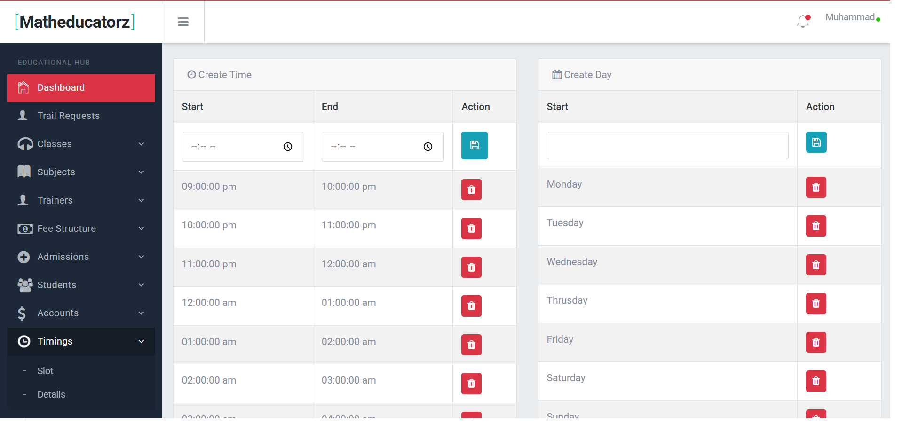

---

# 🌍 General Management

General Management controls the countries available on the website and throughout the educational platform.

Every country automatically becomes available for admissions, pricing, and educational services.

---

## Country Management

### Features

- Add Country
- Country Information
- Contact Details
- WhatsApp
- Email
- Website Integration

### Screenshot

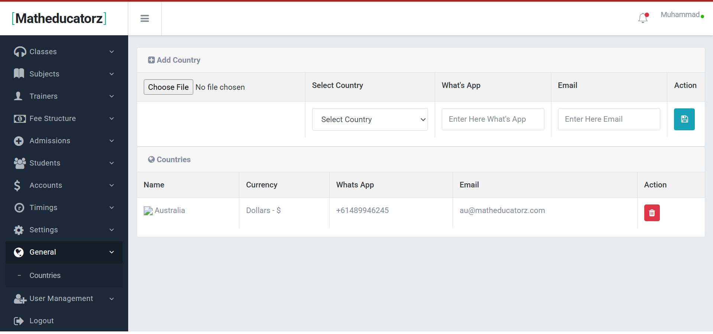

---

# 👥 User Management

Role-based user management allows administrators to create system users with different permissions.

Supported roles include:

- Administrator
- Staff Member
- Manager

---

## Create User

### Features

- Name
- Email
- Password
- User Role
- Permissions

### Screenshot

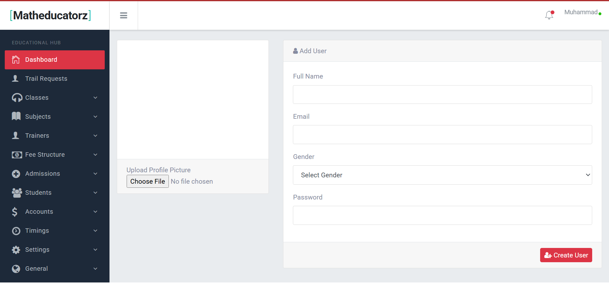

---

## All Users

Displays all registered users.

### Features

- Search User
- Edit User
- Delete User
- Activate / Deactivate
- Permission Control

### Screenshot

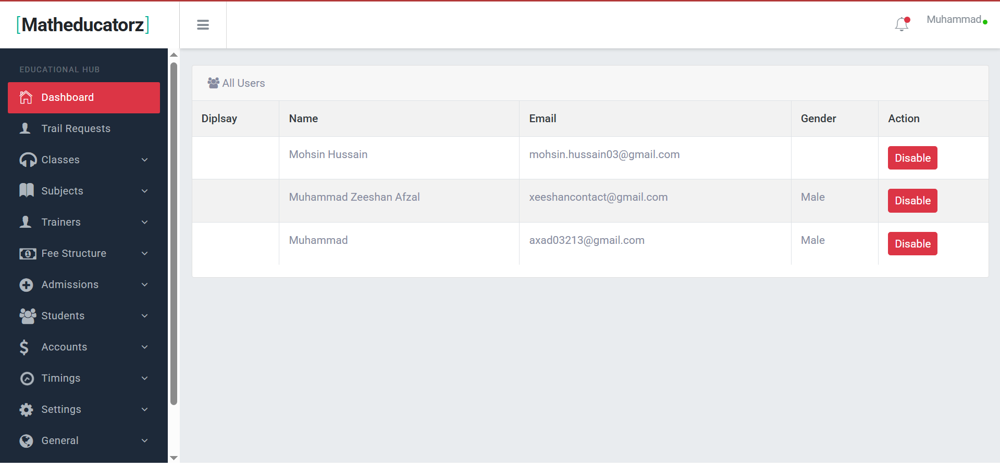

---

# 👨‍🏫 Teacher Portal

Teachers have their own dedicated dashboard with tools to manage students, assignments, and schedules.

The teacher interface is designed to simplify academic activities without exposing administrative functions.

---

## Teacher Dashboard

### Features

- Total Students
- Assigned Subjects
- Pending Assignments
- Quick Statistics

### Screenshot

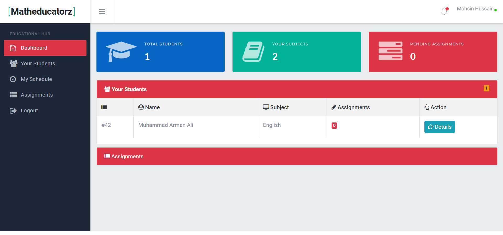

---

## Your Students

Teachers can access complete information about their assigned students.

### Features

- Student Profile
- Academic Information
- Subject Information
- Assignment History

### Screenshot

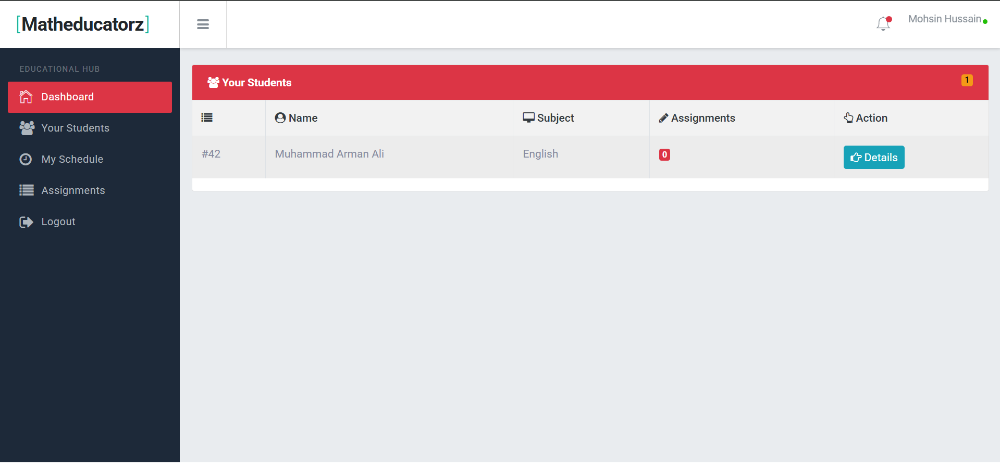

---

## Assign Assignment

Teachers can assign homework directly to enrolled students.

### Features

- Assignment Title
- Description
- Deadline
- File Upload
- Status Tracking

### Screenshot

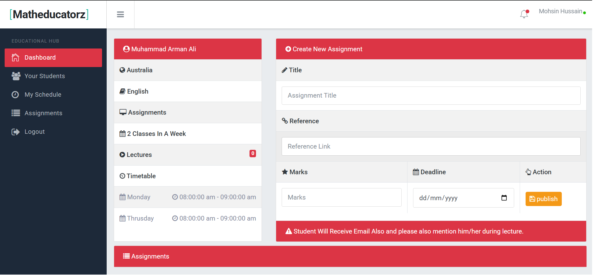

---

## Assignment Management

Teachers can monitor submitted assignments and review student work.

### Features

- Pending Assignments
- Submitted Work
- Review Assignments
- Assignment Status

### Screenshot

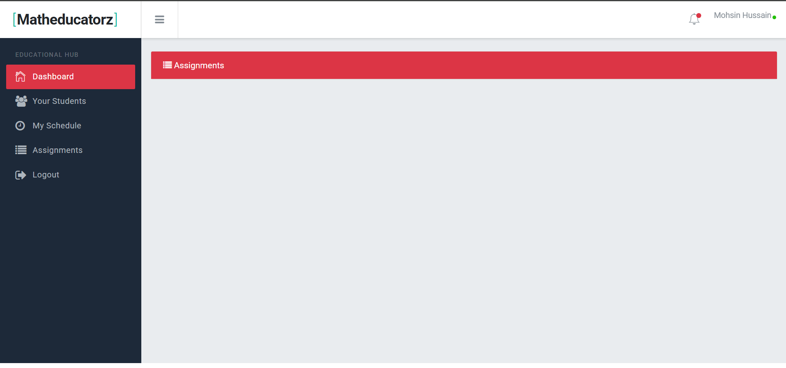

---

## My Schedule

Teachers can view their personal teaching timetable.

### Features

- Daily Schedule
- Weekly Timetable
- Assigned Subjects
- Time Slots

### Screenshot

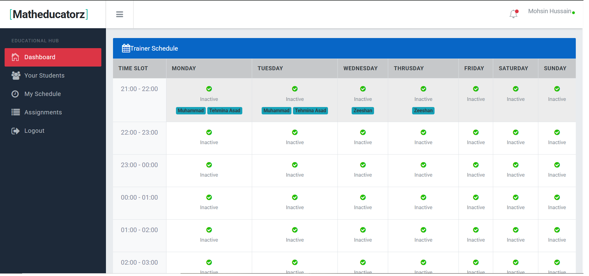

---

# 👨‍🎓 Student Portal

Students receive a personalized dashboard where they can access educational resources and monitor academic progress.

---

## Student Dashboard

### Features

- Assigned Subjects
- Pending Assignments
- Recent Activities
- Quick Overview

### Screenshot

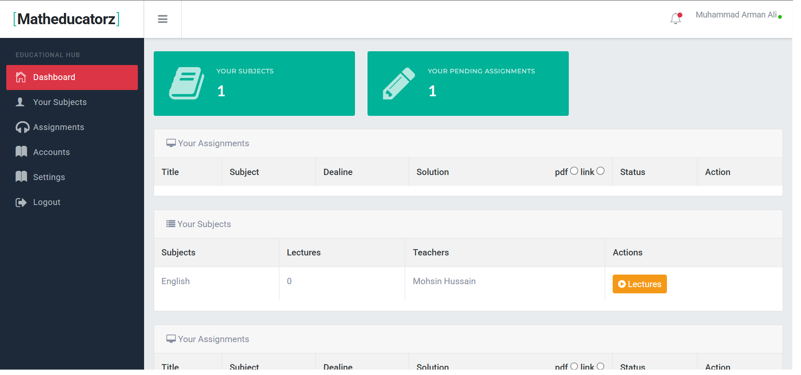

---

## My Subjects

Students can access all enrolled subjects.

### Features

- Subject List
- Teacher Information
- Lecture Access
- Progress Tracking

### Screenshot

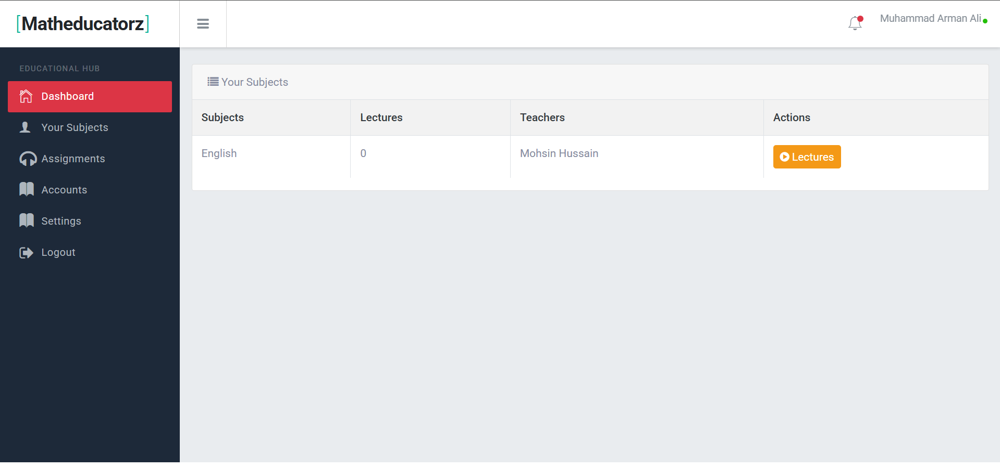

---

## Lecture Recordings

Every enrolled subject contains recorded lectures uploaded by administrators.

### Features

- Video Lectures
- Lesson Organization
- Previous Recordings
- Anytime Learning

---

## Assignments

Students can submit homework directly through the portal.

### Features

- View Assignments
- Upload Solution
- File Submission
- Deadline Tracking
- Submission Status

### Screenshot

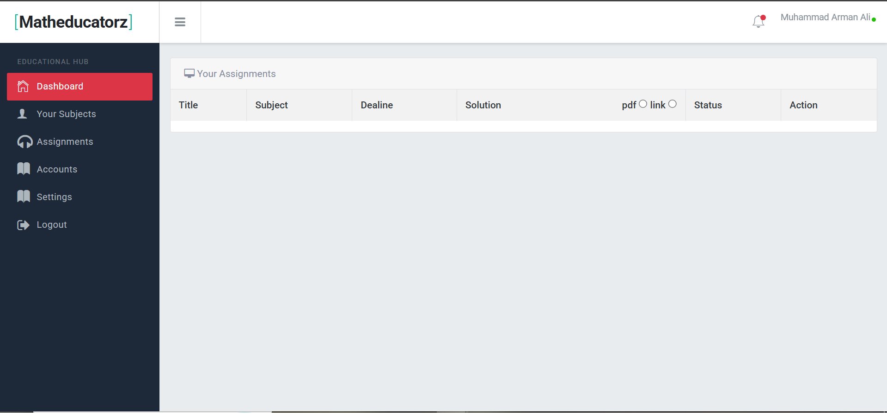

---

## Payments

Students can monitor their payment history.

### Features

- Paid Fees
- Remaining Balance
- Invoice History
- Payment Status

### Screenshot

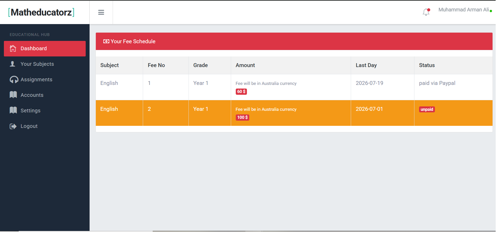

---

## Profile & Settings

Students can manage their account information.

### Features

- Update Profile
- Change Password
- Contact Information
- Personal Settings

---

# 🔒 Security Features

The application follows a role-based security architecture.

### Administrator

- Complete System Access

### Teacher

- Student & Assignment Management
- Personal Schedule
- Subject Access

### Student

- Lecture Access
- Assignment Submission
- Payment Information
- Profile Settings

Every user can only access authorized modules through Laravel middleware and role-based authentication.

---

# 📌 Summary

This project combines the capabilities of multiple enterprise systems into one centralized application.

It is not only a Learning Management System (LMS), but also functions as:

- Educational ERP
- Student Information System (SIS)
- Admission Management System
- Fee Management System
- Teacher Management Platform
- Course Management System
- Assignment Management System
- Academic Scheduling System

With its modular architecture, multi-role authentication, and dynamic website integration, **MathEducatorz** provides a scalable solution for educational institutions operating across multiple countries.

---

# 🚀 Next (Part 4)

The final part will include:

- Installation Guide
- Local Setup
- Environment Configuration
- Folder Structure
- Database Design Overview
- Route Structure
- Future Enhancements
- Skills Demonstrated
- Why I Built This Project
- Author
- License
- GitHub Contribution
- Professional Closing Section
# ⚙️ Installation Guide

Follow the steps below to set up the project locally.

## 1. Clone Repository

```bash
git clone https://github.com/asadmukhtarr/online-tution-management-system/
```

---

## 2. Enter Project Directory

```bash
cd matheducatorz
```

---

## 3. Install PHP Dependencies

```bash
composer install
```

---

## 4. Install JavaScript Dependencies

```bash
npm install
```

---

## 5. Create Environment File

```bash
cp .env.example .env
```

---

## 6. Generate Application Key

```bash
php artisan key:generate
```

---

## 7. Configure Database

Update your **.env** file.

```env
APP_NAME=MathEducatorz

DB_CONNECTION=mysql
DB_HOST=127.0.0.1
DB_PORT=3306
DB_DATABASE=matheducatorz
DB_USERNAME=root
DB_PASSWORD=
```

---

## 8. Run Database Migration

```bash
php artisan migrate
```

---

## 9. Seed Database (Optional)

```bash
php artisan db:seed
```

---

## 10. Start Development Server

```bash
php artisan serve
```

---

## 11. Compile Frontend Assets

```bash
npm run dev
```

---

# 📁 Project Structure

```
MathEducatorz
│
├── app/
├── bootstrap/
├── config/
├── database/
├── public/
├── resources/
│
│── views/
│── css/
│── js/
│
├── routes/
├── storage/
├── tests/
├── vendor/
└── README.md
```

---

# 🗂 Route Organization

The application follows a modular route architecture.

```
/
│
├── Public Website
│
├── Student Portal
│
├── Teacher Portal
│
└── Admin Dashboard
```

---

# 🌍 Public Website Pages

The website provides a complete front-end for visitors.

### Home

Landing page introducing the educational platform.

### About

Organization details.

### Subjects

Browse available courses.

### Subject Details

Complete course information.

### Pricing

Country-wise packages.

### Blog

Educational articles.

### Contact

Contact form.

### Trial Class Booking

Online trial registration.

### Login

Authentication for users.

---

# 🔐 Authentication

The system uses Laravel Authentication with middleware protection.

Supported roles include

- Administrator
- Teacher
- Student

Every role has

- Dedicated Dashboard
- Separate Middleware
- Protected Routes
- Permission Control

---

# 💾 Database Design Overview

The project is built around a relational database structure.

Major entities include

```
Countries

Packages

Students

Admissions

Enrollments

Subjects

Grades

Lessons

Teachers

Assignments

Schedules

Invoices

Payments

Users
```

The relationships ensure consistency between admissions, classes, assignments, trainers, and financial records.

---

# 🔄 Business Workflow

```
Visitor

↓

Website

↓

Trial Class

↓

Admission

↓

Package Selection

↓

Invoice

↓

Payment

↓

Enrollment

↓

Trainer Assignment

↓

Subjects

↓

Live Classes

↓

Lecture Recordings

↓

Assignments

↓

Course Completion
```

---

# 💡 Design Principles

The project has been developed following modern software engineering practices.

### Modular Architecture

Each module is independent and reusable.

---

### Separation of Responsibilities

Business logic, UI, routing, and database operations are properly separated.

---

### Dynamic Data Management

Website content is managed directly from the Admin Panel without code modifications.

---

### Role-Based Access Control

Every user only accesses features assigned to their role.

---

### Scalable Structure

New countries, packages, trainers, students, and educational programs can be added without changing the application's architecture.

---

# 🚀 Skills Demonstrated

This project demonstrates practical experience in

- Laravel Development
- Livewire Components
- PHP Programming
- MySQL Database Design
- Bootstrap 5
- JavaScript
- CRUD Operations
- Authentication
- Authorization
- Role-Based Access
- Dashboard Development
- Educational ERP Development
- Learning Management Systems
- Student Information Systems
- Invoice Management
- Payment Tracking
- Timetable Management
- Assignment Management
- Multi-Country Applications
- Responsive UI Development
- MVC Architecture
- Relational Database Design

---

# 📈 Project Highlights

✔ Enterprise-Level Educational ERP

✔ Multi-Country Support

✔ Learning Management System (LMS)

✔ Student Information System (SIS)

✔ Dynamic Website Integration

✔ Role-Based Authentication

✔ Teacher Dashboard

✔ Student Dashboard

✔ Admission Management

✔ Fee & Invoice Management

✔ Assignment System

✔ Lecture Management

✔ Timetable Management

✔ Package Management

✔ Country Management

✔ User Management

✔ Responsive Dashboard

✔ Modular Architecture

✔ Production-Ready Structure

---

# 🔮 Future Improvements

The platform can be extended with additional enterprise features such as

- Zoom API Integration
- Google Meet Integration
- Live Video Classes
- Attendance Management
- AI-Based Student Performance Analytics
- Parent Portal
- Mobile Application (Flutter)
- Push Notifications
- Email Notifications
- SMS Notifications
- Online Payment Gateway
- Multi-Language Support
- Multi-Currency Support
- REST API
- GraphQL API
- Certificate Generator
- Digital Library
- Discussion Forums
- Quiz & Examination System
- Assignment Auto-Grading
- Student Progress Reports
- Analytics Dashboard

---

# 🤝 Contributing

Contributions are welcome.

If you would like to improve this project:

1. Fork the repository.
2. Create a feature branch.
3. Commit your changes.
4. Push the branch.
5. Open a Pull Request.

---

# ⭐ Why This Project?

MathEducatorz was developed to simplify educational institute management by integrating admissions, student records, teacher management, scheduling, financial operations, assignments, and online learning into a single enterprise platform.

The project demonstrates how Laravel and Livewire can be used to build scalable, secure, and production-ready educational software with a clean modular architecture and role-based access control.

---

# 👨‍💻 Author

## Muhammad Asad

**Full Stack Web & Mobile Application Developer**

### Tech Stack

- Laravel
- Livewire
- PHP
- JavaScript
- Bootstrap
- Vue.js
- React.js
- Node.js
- Express.js
- MongoDB
- MySQL
- REST APIs

---

# 📬 Contact

Email: **contact@asadmukhtar.online**

Portfolio: **https://asadmukhtar.online**

GitHub: **https://github.com/yourusername**

LinkedIn: **https://linkedin.com/in/yourusername**

---

# 📄 License

This project is licensed under the **MIT License**.

You are free to use, modify, and distribute this project in accordance with the terms of the license.

---

# 🙏 Acknowledgements

Special thanks to the Laravel, Livewire, Bootstrap, and Open Source communities for providing the tools and ecosystem that made this project possible.

---

# ⭐ Support

If you found this project useful,

🌟 **Please consider giving it a star on GitHub.**

It helps others discover the project and supports future development.

---

<p align="center">

### 🚀 Built with Laravel ❤️ Livewire ❤️ Bootstrap 5

**Designed & Developed by Muhammad Asad**

</p>